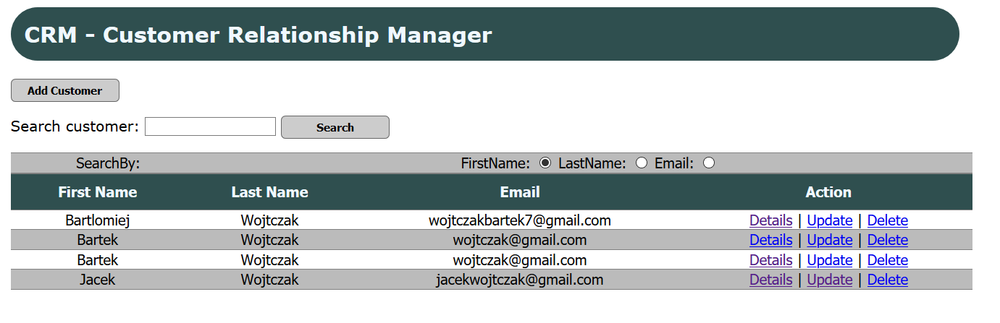
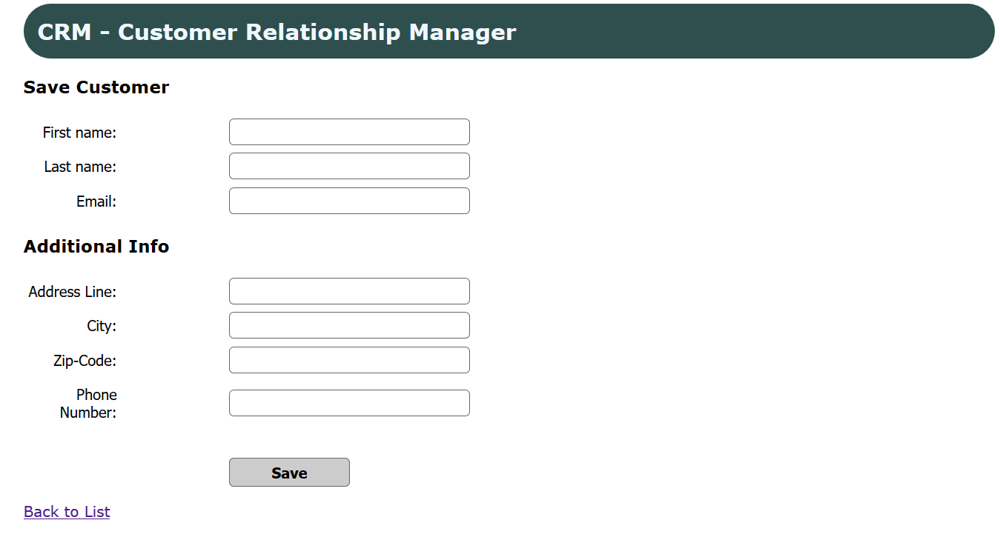

# JavaSpringMVC
> Customer Relationship Manager!

## Table of contents
* [General info](#general-info)
* [Screenshots](#screenshots)
* [Technologies](#technologies)
* [Features](#features)
* [Status](#status)
* [Inspiration](#inspiration)
* [Contact](#contact)

## General info
The purpose of it is to show my skills in frameworks

## Screenshot

## Technologies
* Spring MVC
* Hibernate
* MySQL
* Regex
* CRUD Mechanism

## Features
* Ability to CRUD Customers to the MySql Database
* Ability to Search Customers by FirstName/LastName/Email
* Ability to Add and View Detailed Informations about Customer

## Status
Project is: _finished_

## Inspiration
Based on the Spring & Hibernate for Beginners on Udemy. Improved by me.

## Contact
Created by MrJinno. Email: wojtczakbartek7@gmail.com
