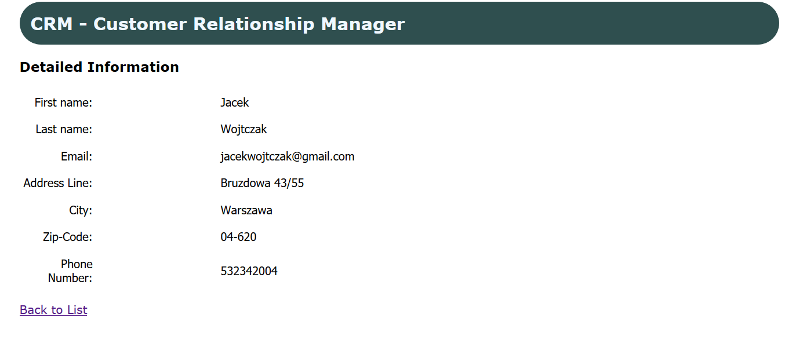

# JavaSpringMVC
> Customer Relationship Manager!
## General info
The purpose of it is to show my skills in frameworks

## Screenshot 1

## Screenshot 2

## Screenshot 3

## Technologies
* Spring MVC
* Hibernate
* MySQL
* Regex
* CRUD Mechanism

## Features
* Ability to CRUD Customers to the MySql Database
* Ability to Search Customers by FirstName/LastName/Email
* Ability to Add and View Detailed Informations about Customer

## Status
Project is: _finished_

## Inspiration
Based on the Spring & Hibernate for Beginners on Udemy. Improved by me.

## Contact
Created by MrJinno. Email: wojtczakbartek7@gmail.com
